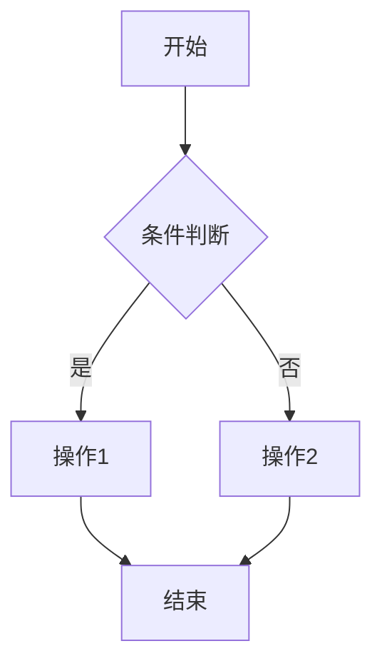

# PRD 模板

## 一、需求背景

描述当前面临的问题或机会。如果需求背景不清晰，主动询问用户。

---

## 二、需求目标

基于需求背景，写出本次项目的核心目标。

---

## 三、需求核心业务流程图

使用 Mermaid 语法绘制完整的业务流程图。

---

## 四、需求功能清单

按结构化表格表达：

| 终端 | 模块 | 功能 | 描述 |
|------|------|------|------|
| 慧帮手APP | 首页 | -banner轮播 | 展示促销活动 Banner，支持点击跳转 |
| 慧帮手APP | 我的 | -订单查询 | 支持按状态筛选订单列表 |
| 后端 | 订单服务 | -稽查规则引擎 | 根据规则匹配异常订单 |

**格式要求**：
- 终端：门店APP / 门店PC / 供应链中台 / 客户小程序 / 门店后端 / 供应链中台后端 / 客户小程序后端
- 模块：所属功能模块
- 功能：前端功能一个功能对应一个页面或弹窗；后端功能按后端能力/服务拆解
- 描述：功能的具体说明

---

## 五、需求功能详述

与第四部分需求功能清单保持一致，按模块分组，每个功能单独详细描述。

**每个功能的详细描述格式**（标题带序号，如 5.1、5.2）：

---

#### 5.x 终端——模块——功能名称

**原型描述**：
无原型则填"无"；有原型则写简洁描述，作为 AI 画原型的提示词。

**用户故事**：
> 作为一个 [角色]，我想要 [操作]，以便于 [价值]。

**前置条件**：
- 用户需满足的状态或权限

**核心逻辑**：
- 计算规则、权限控制、数据流向

**边界条件与异常处理**：
- 边界条件：输入极限值、空值
- 异常处理：网络异常、数据冲突等处理方案

**埋点需求**（若需要）：
- 事件 ID：`EVENT_XXX`
- 触发时机：[具体时机]
- 上报参数：[参数列表]

**技术难点分析**：
- [难点1]
- [难点2]

**验收标准 (Acceptance Criteria)**：
- 🎯 **成功场景**：输入 X，产出 Y
- ✔️ **校验场景**：输入错误格式，系统如何拦截
- ❌ **异常场景**：网络异常/超时，系统如何处理

**测试用例**（遵循 MECE 原则，每条用例语言精简，不超过 20 字）：
- [用例1]
- [用例2]
- [用例3]

---

**原型描述编写规范**：
- 描述页面布局和关键元素
- 说明交互方式和状态
- 标注重要样式（颜色、位置）
- 示例："商品列表页顶部固定搜索栏，下方2列网格展示商品卡片，卡片含图片、名称、价格"
