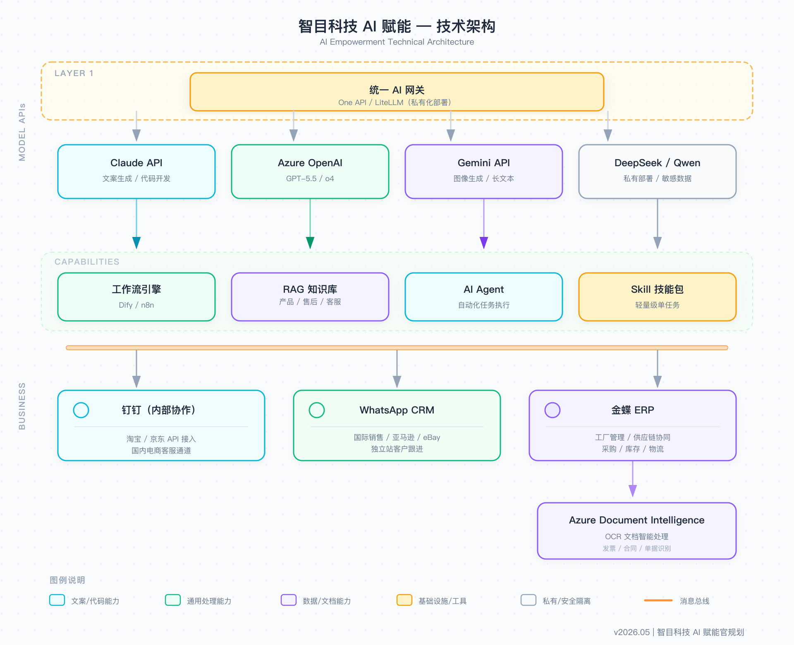

# AI 赋能官岗位规划书

**应聘岗位**：AI 赋能官  
**目标公司**：深圳市智目科技有限公司 / 智目电子商务有限公司  
**日期**：2026 年 5 月

---

## 执行摘要

智目当前横跨跨境电商、无人机研发制造、线下零售三大业务，销售渠道涵盖亚马逊、eBay、速卖通、B2C 独立站、淘宝/京东及华强北两家线下门店，运营团队多元、系统分散、AI 应用近乎空白。

**我的核心承诺：90 天内把 AI 基础设施跑起来，6 个月内交出可量化效率数据，12 个月内让每个部门都有自己的专属 AI 工具包。**

---

## 一、实施方式说明

文档中每项 AI 应用均标注实施方式，便于判断成本与周期：

| 标注 | 含义 | 代表工具 | 实施周期 |
|------|------|---------|---------|
| 🔧 **工作流** | 无需写代码，用可视化平台拖拉拼接 | Dify、Coze、n8n、Make | 1-2 周 |
| 🏗️ **搭建系统** | 需要 API 对接或定制开发 | 自研 Agent、RAG 系统、数据库 | 1-3 个月 |
| 🔌 **接入工具** | 直接采购/订阅现成 SaaS | Copilot、DeepL、ElevenLabs | 当天可用 |

---

## 二、现状诊断

**销售与客户运营**

| 部门/角色 | 核心痛点 | AI 可介入点 |
|---------|---------|-----------|
| 国际销售 / 外贸业务员 | 询盘响应慢，多语言邮件/报价靠人工，展会线索丢失率高 | 智能回复助手、多语言邮件起草、展会名片自动录入 CRM |
| 国内销售 / 淘宝京东客服 | 重复咨询量大、旺旺/京东客服切换繁琐，促销期压力集中 | 平台客服 AI 辅助回复、活动文案批量生成 |
| 亚马逊 / eBay / 速卖通运营 | 多平台 Listing 重复撰写，差评处理耗时，竞品监控靠人工；同时使用 WhatsApp CRM 跟进海外买家 | 内容批量生成流水线、差评智能回复、竞品自动监控、WhatsApp 智能回复 |
| B2C 独立站运营 | 站内无 AI 客服、SEO 内容产出慢，用户行为分析靠感觉；同样依赖 WhatsApp CRM 与海外客户沟通 | 智能客服 + SEO 内容生成 + 数据分析报告、WhatsApp 智能回复 |
| 售后客服 | 工单量大，重复问题占 70% 以上，国际客户多语言压力大 | AI Agent 智能客服、工单自动分类分派 |
| 华强北线下门店（2 家）| 线索无法沉淀 CRM，导购知识全靠人记，复购跟进弱 | 导购知识库助手、客户信息扫码录入、复购自动提醒 |

**供应链与运营**

| 部门/角色 | 核心痛点 | AI 可介入点 |
|---------|---------|-----------|
| 采购部 | 询价邮件重复撰写，供应商比价靠人工汇总，采购单录入 ERP 耗时 | AI 起草询价函、供应商报价自动汇总对比、OCR 自动录入 ERP |
| 计划部门 | 补货靠经验拍脑袋，库存积压无预警，大促备货难量化 | SKU 销量预测、积压预警 + 处置建议、大促备货规划 |
| 跨境头程物流专员 | 报关单/提单人工录入，合规检查全靠人，目的地敏感性判断滞后 | 文件 OCR 自动录入、出口合规 AI 预检、多物流商报价汇总 |
| 国内仓储 / 发货团队 | 发货核单靠人工比对，异常件发现慢，出入库记录手工维护 | 订单与库存数据自动比对、异常预警推送、出入库记录辅助 |

**研发与产品**

| 部门/角色 | 核心痛点 | AI 可介入点 |
|---------|---------|-----------|
| 无人机研发团队 | 技术文档/用户手册撰写耗时，专利材料准备周期长，多语言版本靠人工翻译 | AI 辅助技术文档生成、专利材料起草、多语言用户手册批量翻译 |
| 无人机测试人员 | 测试报告撰写耗时，缺陷描述不标准，历史缺陷重复踩坑 | 测试报告自动生成、缺陷标准化描述、历史缺陷 RAG 检索 |
| IT / ERP 开发团队 | 开发效率低，需求文档靠口头沟通，测试用例手写，API 文档缺失 | 代码辅助（Claude Code）、需求文档生成、测试用例自动生成 |

**财务与行政**

| 部门/角色 | 核心痛点 | AI 可介入点 |
|---------|---------|-----------|
| 财务| 账单核对手工比对，报表生成耗时，多系统数据需人工汇总 | 账单自动核对、财务报表一键生成、多平台数据自动汇总 |
| 财务（海外 VAT）| 多国税务规则复杂，申报材料整理耗时，汇率波动风险难量化 | VAT 合规助手、申报材料自动整理、汇率风险提示 |
| 行政 / HR | 会议纪要靠人工记录，招聘 JD 撰写耗时，员工培训材料制作慢 | 会议录音转写 + 摘要、JD 自动生成、培训材料 AI 辅助制作 |

**内容与品牌**

| 部门/角色 | 核心痛点 | AI 可介入点 |
|---------|---------|-----------|
| 视频剪辑人员 | 脚本撰写耗时，素材找图低效，多语言配音靠外包 | AI 脚本生成、AI 生图/视频素材、多语言配音（ElevenLabs）|
| 设计人员 | 重复性物料制作量大，产品场景图拍摄成本高，展会物料赶工压力大 | 产品场景图 AI 生成、物料批量生产、展会素材快速出图 |

**基础设施**

| 问题类别 | 现状 | 风险 |
|---------|------|------|
| AI 工具访问 | 翻墙 + 个人账号，不稳定 | 随时封号，数据泄露，无法统一管控 |
| 两套 CRM 系统 | 国内/国际割裂，数据无法互通 | 客户全貌缺失，跟进断层 |
| 金蝶 ERP 数据孤岛 | ERP 数据难以对接 AI 工具 | 智能预测、自动录入等场景受阻 |

---

## 三、AI 模型全景图（2026 年推荐配置）

> 工具选型原则：不迷信单一模型，按场景选最合适的，通过统一网关管理，随时可以切换。

### 3.1 文本与推理模型

| 模型 | 提供商 | 接入方式 | 适用场景 |
|------|------|---------|---------|
| **Claude Opus 4.7 / Sonnet 4.6** | Anthropic | Anthropic API | 长文档处理、营销文案、代码开发、深度分析；Opus 4.7 支持多 Agent 编排，综合能力最强 |
| **GPT-5.5 / GPT-5.5 Instant** | OpenAI | **Azure OpenAI**（推荐）| 内容生成、多轮对话、产品描述；Instant 版响应更快，适合高频场景 |
| **o4-mini** | OpenAI | Azure OpenAI | 复杂推理（供应链优化、VAT 税务计算、库存预测模型），成本低于 o3 |
| **Gemini 3.5 Flash** | Google | Google AI API | 编码与 Agent 任务，速度是 3.1 Pro 的 4×，适合高频自动化场景 |
| **Gemini 3.5 Pro** | Google | Google AI API | 超长上下文、多文件理解（产品手册/合同批量处理）|
| **DeepSeek V4-Flash / V4-Pro** | 深度求索 | 私有化部署 | 敏感业务数据处理，超长上下文，私有化成本极低，适合财务/客户等不出境数据 |
| **Qwen 3.7** | 阿里云 | 私有化部署 | 国内业务数据处理，中文优化，MTEB 排名领先的中文模型 |

> **Azure OpenAI 说明**：与 OpenAI 官网同款模型，部署在微软云，支持国内企业合规通道，不需要翻墙，数据受 Azure 企业级协议保护，不会封号。当前支持 GPT-5.5 系列、o4-mini、DALL·E 3、GPT-4o-transcribe 等。

### 3.2 图像生成模型

| 模型 | 优势 | 推荐场景 |
|------|------|---------|
| **GPT Image 2** | prompt 理解最强，文字渲染精准 | 产品主图、含文字的包装/营销图 |
| **Google Imagen 4** | 文字排版业界最佳 | 含中英文字的详情页图、展会物料、标签设计 |
| **FLUX 2 Pro** | 写实质量领先，速度/质量平衡最佳 | 产品场景图、批量写实图生成 |
| **Midjourney v8** | 美学质感最高，高分辨率输出 | 品牌宣传大图、高端展示素材 |
| **Recraft V3** | 矢量风格最优 | Logo 变体、图标、VI 物料 |
| **Seedream / 即梦** | 国内平台，中文 prompt 友好 | 淘宝/京东/小红书营销图 |

### 3.3 视频生成模型

| 模型 | 优势 | 推荐场景 |
|------|------|---------|
| **Kling 3.0** | 运镜流畅，原生音频同步 | 无人机产品 demo、展会宣传片 |
| **Google Veo 3.1** | 原生 4K，指令跟随最强 | 全渠道通用宣传视频 |
| **Runway Gen-4.5** | 图生视频角色一致性最佳，精准镜头控制 | 品牌叙事大片、产品故事视频 |
| **Seedance 2.0** | 音视频联合架构（边听边生成），新兴高潜力 | 带背景音乐的产品展示视频 |
| **Vidu 2.0** | 多参考图一致性好，速度快 | 电商产品展示视频批量生产 |

### 3.4 翻译模型（混合策略）

| 场景 | 推荐方案 | 原因 |
|------|---------|------|
| 产品 Listing / 营销文案 | Claude Sonnet 4.6 润色 | 语气地道，品牌调性一致 |
| 报关 / 合同 / 法律文件 | **DeepL Pro** | 专业文件翻译精度业界领先，CJK↔英文术语最稳定 |
| 售后邮件 / 工单高频回复 | GPT-5.5 Instant（Azure）| 速度最快，成本低，40+ 语言全覆盖 |
| 用户手册（超长批量翻译）| Gemini 3.5 Pro | 超长上下文，多文件前后一致性好 |
| 展会/客户实时语音沟通 | **DeepL Voice-to-Voice**（2026 年 4 月上线）| 实时语音互译，40+ 语言，支持语音风格保留 |

> 翻译不绑定单一模型，根据场景灵活切换，通过 Dify 工作流统一入口管理。

### 3.5 其他专项模型

| 类别 | 推荐工具 | 说明 |
|------|---------|------|
| **语音转文字** | **GPT-4o-transcribe** | 支持说话人识别，精度优于 Whisper，展会录音/会议纪要首选 |
| **文字转语音** | **ElevenLabs** | 仍是 TTS 最强，支持声线克隆，产品视频多语言配音 |
| **OCR 文档提取** | Azure Document Intelligence | 报关单、发票、采购单关键信息提取，精度高 |
| **向量嵌入（RAG）** | **Qwen3-Embedding** / Gemini Embedding 2（多模态）| 产品知识库、售后知识库、多模态文档检索 |
| **视觉理解** | Claude Opus 4.7 Vision / Gemini Omni | 产品图分析、质检辅助、竞品图解读；Gemini Omni 支持图/音/视频/文混合输入 |
| **代码开发** | Claude Code / OpenAI Codex | ERP 定制开发、API 对接，支持完整代码仓库级上下文 |
| **实时语音互译** | DeepL Voice-to-Voice | 展会现场、海外客户视频会议实时口译 |

---

## 四、30-60-90 天执行路线图

### 第一阶段（第 1-30 天）：夯实基础，摸清场景

**任务一：AI 工具访问合规化** 🏗️ 搭建系统（第 1-2 周）

- 部署统一 AI 网关（One API / LiteLLM），集中管理所有模型的调用权限和配额
- 接入 Azure OpenAI（GPT-5.5、o4-mini）、Anthropic API（Claude Opus 4.7 / Sonnet 4.6）、Google AI（Gemini 3.5）
- 私有化部署 DeepSeek V4 / Qwen 3.7，处理财务、客户等敏感数据
- 废弃个人翻墙账号方案，API Key 统一网关管理，不下发个人

**任务二：主动发现 AI 场景**（第 2-4 周）

> **核心认知**：等员工主动提需求是不现实的。大多数人不知道 AI 能做什么，也不知道自己的痛点可以被解决。场景发现需要主动出击，而不是等待。

**方法一：影子跟访（最重要）**
- 不是开会，而是坐到员工旁边，看他们实际怎么工作
- 重点观察：哪些操作在重复、哪里需要切换窗口、哪里会叹气或犯错
- 目标：每个重点岗位至少跟访半天（国际销售、售后、运营、物流专员）

**方法二：数据倒推**
- 向 ERP / CRM 要数据，找出：工单量最大的问题类型、处理时间最长的业务环节、返工率最高的流程
- 数据不会骗人，比访谈更客观

**方法三：浅访谈 + 给 Demo 激发需求**
- 不问"你需要 AI 做什么"（员工答不上来）
- 而是带着一个 AI 工具 Demo 去演示，问"这个能帮到你吗"
- 看到真实工具后，员工才会产生具体反应

**覆盖对象**（12 个部门/角色）：

国际销售、亚马逊运营、eBay 运营、速卖通运营、B2C 独立站、售后客服、计划部门、跨境物流、财务/VAT、无人机测试、视频剪辑、华强北门店

**输出物**：《AI 场景优先级矩阵》（影响规模 × 实施难度双轴排序），每个场景附真实痛点来源（观察 / 数据 / 访谈）

---

### 第二阶段（第 31-60 天）：五个试点，跑出标杆

#### 试点 A：售后 AI 智能客服系统 🏗️ 搭建系统

这是全公司客户满意度的最后一道防线，也是重复劳动最集中的地方。

**构建产品知识库**
- 将无人机产品手册、故障代码、维修流程文档化，建立 RAG 向量知识库（BGE-M3 嵌入）

**多渠道 AI Agent 部署**
- 国内渠道（淘宝/京东/B2C 站/钉钉）：自动回复常见售后问题，超出知识库范围转人工
- 国际渠道（WhatsApp/eBay 站内信/独立站邮件）：多语言自动回复（英/西/法/日/阿）
- 工单自动分类：按问题类型（硬件故障/软件/操作）自动分派对应售后专员

**知识库自动沉淀**
- 人工解答的新问题 → 自动推荐录入知识库 → 定期人工审核更新

**预期数据**：人工介入率 ↓50%，首次响应时间 ↓70%

---

#### 试点 B：多平台内容生产流水线 🔧 工作流

覆盖亚马逊、eBay、速卖通、淘宝/京东、B2C 独立站五个渠道：

**Dify 工作流搭建**
- 输入：产品参数 + 目标平台 + 目标语言
- 输出：各平台适配标题、五点描述、详情页文案、A+ 内容草稿
- 差评智能回复：识别情绪 → 生成安抚话术 + 解决方案 → 人工确认后发出
- 好评批量回复：根据评价内容生成个性化感谢回复

**图片生成辅助**
- GPT Image 2：产品白底图生成、包装设计
- Ideogram 3.0：含中英文字的详情页图
- FLUX 1.1 Pro：场景图、生活方式图批量生成

**预期数据**：内容生产时间 ↓60%，五平台同步上线从 5 天压缩至 1 天

---

#### 试点 C：库存智能预测 + 积压预警 🏗️ 搭建系统

库存积压是跨境电商最大的隐性成本，需要 AI 主动干预：

**预测模型**
- 接入金蝶 ERP 历史销售数据
- 结合各平台大促节点（双十一、Prime Day、黑五、Cyber Monday）
- 建立 SKU 级别 90 天滚动销量预测

**积压预警机制**
- 库存周转天数 >60 天 → 黄色预警 + 处置建议（降价促销 / 多平台分流）
- 库存周转天数 >90 天 → 红色预警 + 自动生成处置方案（捆绑销售 / 清仓定价 / 速卖通低价清库）
- 每周自动生成《库存健康度报告》，通过钉钉推送计划部门负责人

**补货建议单**
- 预测销量 + 当前库存 + 采购周期 → 自动输出补货建议，人工确认后导入采购流程

**预期数据**：库存积压金额 ↓30%，断货率 ↓40%，补货决策时间 ↓60%

---

#### 试点 D：WhatsApp 智能助手 + 展会线索管理 🔧 工作流 + 🏗️ 搭建系统

> WhatsApp CRM 是国际销售、亚马逊/eBay 运营、B2C 独立站共用的沟通工具，本试点覆盖所有使用 WhatsApp 跟进海外客户的团队。

**WhatsApp 智能回复** 🔧 工作流
- 产品知识库 RAG + WhatsApp CRM API 接入
- 询盘意图自动识别 → 推荐标准回复 → 销售/运营确认后一键发送
- 支持：英/西/法/日/阿/俄语

**展会线索管理** 🔧 工作流
- 展会名片拍照 → Gemini Vision OCR 提取联系人信息 → 自动录入 CRM
- 自动生成首封英文跟进邮件草稿，销售一键发送
- 展会结束后 24 小时内完成所有线索录入

**预期数据**：WhatsApp 响应时间 ↓80%，展会线索录入效率 ↑80%，丢失线索率趋近于零

---

#### 试点 E：跨境物流 + 报关文件自动化 🔧 工作流

**文件处理自动化**
- 采购单/报关文件 PDF → Azure Document Intelligence OCR → 关键信息提取 → 自动录入金蝶 ERP
- 减少人工录入，错误率趋近于零

**出口合规预检** 🔧 工作流
- 输入目的地国家 → AI 自动比对出口管制清单（瓦森纳协定、制裁国家列表）
- 高风险地区自动标红预警，附合规建议

**预期数据**：文件处理时间 ↓70%，合规风险事前拦截率 ↑90%

---

### 第三阶段（第 61-90 天）：复盘数据，推广扩散

- 五个试点项目效率对比报告（附前后数据对比）
- 启动分层 AI 培训（见第六节）
- 上线内部 AI 知识库（钉钉文档），录入不少于 20 个最佳实践案例
- 制定各部门 AI 工具包落地计划（见第五节）

---

## 五、各部门 AI 工具包（6-12 个月目标）

---

### 🌍 国际销售 / 外贸业务员工具包

| 工具/场景 | 实施方式 | 方案 | 核心价值 |
|---------|---------|------|---------|
| WhatsApp AI 回复助手 | 🏗️ 搭建系统 | RAG 知识库 + CRM API | 响应时间 ↓80% |
| 多语言商务邮件撰写 | 🔧 工作流 | Claude + 语言风格模板 | 告别翻译软件，地道商务表达 |
| 合同/报价单辅助 | 🔧 工作流 | Claude 文档分析 + 模板生成 | 报价效率↑，风险条款提示 |
| 展会名片自动录入 | 🔧 工作流 | Gemini Vision OCR + CRM | 展会结束当天完成线索整理 |
| 敏感地区出口预警 | 🔧 工作流 | 制裁清单 AI 比对 | 规避合规风险 |
| 客户背调摘要 | 🔧 工作流 | 网页抓取 + Claude 分析 | 拜访前快速了解客户背景 |

---

### 🛒 亚马逊 / eBay / 速卖通运营工具包

| 工具/场景 | 实施方式 | 方案 | 核心价值 |
|---------|---------|------|---------|
| 多平台 Listing 批量生成 | 🔧 工作流 | Dify + GPT-4.1 | 五平台同步上线，时间 ↓60% |
| 关键词研究 + SEO 优化 | 🔌 接入工具 | Helium 10 + AI 分析 | 搜索排名提升 |
| 差评智能回复 | 🔧 工作流 | 情绪识别 + Claude 生成 | 差评处理速度 ↑5× |
| A+ 内容 / 详情页设计辅助 | 🔧 工作流 | GPT Image 2 + Ideogram | 视觉内容生产成本 ↓50% |
| 竞品监控周报 | 🔧 工作流 | 数据抓取 + AI 分析摘要 | 每周自动推送竞品动态 |
| 广告文案 A/B 测试 | 🔧 工作流 | Claude 批量生成变体 | 广告 CTR 持续优化 |

---

### 🏪 B2C 独立站工具包

| 工具/场景 | 实施方式 | 方案 | 核心价值 |
|---------|---------|------|---------|
| 站内 AI 客服 | 🏗️ 搭建系统 | RAG + 独立站接入 | 7×24 自动响应 |
| SEO 内容批量生产 | 🔧 工作流 | 关键词 + Claude 长文生成 | 自然流量↑ |
| 产品描述本地化 | 🔧 工作流 | DeepL Pro + Claude 润色 | 各语言市场转化率↑ |
| 用户行为分析 | 🔌 接入工具 | GA4 数据 + AI 分析报告 | 选品和运营决策支持 |

---

### 🛠️ 售后客服工具包

| 工具/场景 | 实施方式 | 方案 | 核心价值 |
|---------|---------|------|---------|
| AI 智能客服 Agent | 🏗️ 搭建系统 | RAG + 多渠道接入 | 人工介入率 ↓50% |
| 故障诊断助手 | 🏗️ 搭建系统 | 产品知识库 + 故障树模型 | 远程诊断准确率↑ |
| 工单智能分类分派 | 🏗️ 搭建系统 | NLP 分类 + 规则引擎 | 分派时间 ↓80% |
| 多语言售后回复 | 🔧 工作流 | GPT-4.1 多语言 | 海外客户满意度↑ |
| 维修进度自动通知 | 🔧 工作流 | ERP 状态变更 → 自动发消息 | 客户焦虑↓，投诉率↓ |
| 知识库自动沉淀 | 🏗️ 搭建系统 | 人工回复归档 + 定期审核 | 经验不流失，新人上手快 |

---

### 📦 计划部门工具包

| 工具/场景 | 实施方式 | 方案 | 核心价值 |
|---------|---------|------|---------|
| SKU 销量预测 | 🏗️ 搭建系统 | ERP 历史数据 + 时序模型 | 补货决策科学化 |
| 库存积压预警 | 🏗️ 搭建系统 | 周转天数监控 + 处置建议 | 积压金额 ↓30% |
| 自动补货建议单 | 🏗️ 搭建系统 | 预测 + 采购周期计算 | 决策时间 ↓60% |
| 库存健康度周报 | 🔧 工作流 | 自动生成 + 钉钉推送 | 管理层实时掌握库存状态 |
| 大促备货规划 | 🔧 工作流 | 节点日历 + 历史数据分析 | 大促不断货，平时不积压 |

---

### 🚚 跨境头程物流专员工具包

| 工具/场景 | 实施方式 | 方案 | 核心价值 |
|---------|---------|------|---------|
| 报关文件 OCR 自动录入 | 🔧 工作流 | Azure Document Intelligence + ERP | 录入时间 ↓70%，错误率→0 |
| 出口合规预检 | 🔧 工作流 | 制裁清单 + AI 比对 | 事前拦截合规风险 |
| 物流商询价对比 | 🔧 工作流 | 多渠道报价 → AI 汇总对比 | 选价决策时间 ↓50% |
| 货运跟踪摘要 | 🔧 工作流 | 物流 API + 异常自动预警 | 异常早发现，损失↓ |

---

### 💰 财务 / 海外 VAT 工具包

| 工具/场景 | 实施方式 | 方案 | 核心价值 |
|---------|---------|------|---------|
| VAT 合规助手 | 🔧 工作流 | Claude + 多国税务规则知识库 | 税务计算准确率↑，漏报风险↓ |
| 财务报表智能解读 | 🔧 工作流 | 数据上传 + LLM 生成管理摘要 | 决策响应速度↑ |
| 多货币汇率风险提示 | 🔧 工作流 | 实时汇率 + o4-mini 风险分析 | 汇兑损失风险↓ |
| 账单核对自动化 | 🔧 工作流 | OCR + 规则引擎比对 | 核对效率↑，人工差错↓ |
| 税务申报材料整理 | 🔧 工作流 | 文档分类 + 关键信息提取 | 申报准备时间↓ |

---

### ✈️ 无人机测试人员工具包

| 工具/场景 | 实施方式 | 方案 | 核心价值 |
|---------|---------|------|---------|
| 测试报告自动生成 | 🔧 工作流 | 测试数据录入 → Claude 结构化报告 | 报告撰写时间 ↓70% |
| 缺陷描述标准化 | 🔧 工作流 | 输入口头描述 → 标准缺陷单格式 | 研发理解准确率↑ |
| 历史缺陷检索 | 🏗️ 搭建系统 | 测试报告 RAG 知识库 | 避免重复测试同类问题 |
| 飞行日志分析 | 🔧 工作流 | 日志上传 → AI 异常识别摘要 | 故障定位速度↑ |
| 竞品产品图分析 | 🔧 工作流 | Gemini Vision 解析竞品外观 | 快速获取竞品结构参考 |

---

### 🎬 视频剪辑人员工具包

| 工具/场景 | 实施方式 | 方案 | 核心价值 |
|---------|---------|------|---------|
| 产品视频脚本生成 | 🔧 工作流 | Claude + 产品卖点结构模板 | 脚本创作时间 ↓50% |
| AI 视频素材生成 | 🔌 接入工具 | Kling 3.0 / Vidu 2.0 | 减少实拍成本，快速出素材 |
| 产品场景图/封面图 | 🔌 接入工具 | FLUX 1.1 Pro / Midjourney v7 | 设计外包成本↓ |
| 多语言配音 | 🔌 接入工具 | ElevenLabs（克隆品牌声线）| 一次录音，多语言输出 |
| 字幕自动生成 | 🔌 接入工具 | Whisper 转写 + 时间轴对齐 | 字幕制作时间 ↓90% |
| 展会宣传片快速剪辑 | 🔧 工作流 | 脚本 + 素材 + AI 辅助剪辑建议 | 展前交付速度↑ |

---

### 🏪 华强北线下门店工具包

| 工具/场景 | 实施方式 | 方案 | 核心价值 |
|---------|---------|------|---------|
| 导购智能问答助手 | 🏗️ 搭建系统 | 产品知识库 RAG（平板/屏幕展示）| 导购效率↑，客户体验↑ |
| 客户信息快速录入 | 🔧 工作流 | 扫码/名片 → 自动录入 CRM | 线索不丢失，复购跟进有据 |
| 到店客户复购提醒 | 🔧 工作流 | CRM 触发 → 自动发送跟进消息 | 复购率↑ |
| 门店销售日报自动生成 | 🔧 工作流 | POS 数据 → 自动汇总推送 | 管理层实时掌握门店动态 |

---

### 💻 IT / ERP 开发团队工具包

| 工具/场景 | 实施方式 | 方案 | 核心价值 |
|---------|---------|------|---------|
| 代码开发辅助 | 🔌 接入工具 | **Claude Code / OpenAI Codex**（支持整个代码仓库级上下文，适合复杂 ERP 业务逻辑，优于 Copilot 的行级补全）| 开发效率 ↑30-50% |
| 需求文档生成 | 🔧 工作流 | 口头描述 → Claude 输出结构化 PRD | 需求沟通成本↓ |
| 代码 Review 辅助 | 🔌 接入工具 | Claude 代码审查 + 安全扫描 | Bug 率↓，代码质量↑ |
| 测试用例自动生成 | 🔧 工作流 | 代码输入 → 自动输出单测/集成测试 | 测试覆盖率↑ |
| API 文档自动生成 | 🔧 工作流 | 代码 → 标准 API 文档 | 对接效率↑ |

---

### 🔬 研发部门（无人机）工具包

| 工具/场景 | 实施方式 | 方案 | 核心价值 |
|---------|---------|------|---------|
| FPV 产品多语言用户手册 | 🔧 工作流 | Gemini 超长文档 + DeepL 翻译 | 翻译成本 ↓80% |
| 专利材料辅助撰写 | 🔧 工作流 | Claude + 专利结构模板 | 专利申请周期↓ |
| 客户技术支持 FAQ | 🏗️ 搭建系统 | 技术文档 RAG 知识库 | 技术客服人工介入↓ |
| 飞行数据异常分析 | 🔧 工作流 | 数据上传 + o4-mini 推理分析 | 研发问题定位速度↑ |
| 竞品产品拆解分析 | 🔧 工作流 | Gemini Vision 图像理解 + 分析报告 | 竞品研究效率↑ |

---

## 六、实施原则

### 原则一：低成本验证优先，ROI 正向再扩容

所有 AI 场景的推进路径：

**第一步：工作流 / SaaS 工具验证（1-2 周）**
→ 根据场景复杂度选合适工具：
- **Skill / Claude 直调**：最轻量，适合单一任务验证（如一键生成 Listing、翻译邮件），当天可出结果
- **Dify / Coze**：适合需要多步骤串联的场景（如：输入产品参数 → 生成多平台文案 → 自动翻译），可视化搭建，1-3 天上线
- **n8n / Make**：适合需要对接多个外部系统的自动化（如 CRM 触发 → 生成回复 → 发送 WhatsApp），1 周内可跑通
- **现成 SaaS 直接接入**：有现成工具就直接用，不重复造轮子

**第二步：量化 ROI（4-8 周）**
→ 有效果的场景记录前后对比数据，用数据争取资源

**第三步：私有化 / 系统化开发（有 ROI 后才启动）**
→ 避免大投入低回报，每个场景先"外挂"，有价值再"内嵌"

**预算参考量级**（不同阶段的月度 API 支出参考）：

| 阶段 | 预算范围 | 覆盖内容 |
|------|---------|---------|
| 试验期（1-2 个月）| 3,000 - 8,000 元/月 | 网关 + 主要模型 API + 工作流平台 |
| 试点运行（3-6 个月）| 8,000 - 20,000 元/月 | 扩展至 5 个试点场景 + 知识库存储 |
| 规模部署（6 个月后）| 按 ROI 结果动态扩容 | 以效率数据倒推工具投入上限 |

### 原则二：不替代员工，先增强员工

AI 在智目的定位：**帮员工处理重复性工作，把时间还给判断性工作。**

第一阶段不以减员为目标，而是：
- 让销售更快回复客户
- 让运营批量处理多平台
- 让售后减少重复解释
- 让计划部门提前看到库存风险

### 原则三：关键业务保留人工兜底

- AI 输出内容（客服回复、报价、合同）上线前需人工确认机制
- 财务、VAT、合规类输出，AI 提供草稿，人工审核签发
- 异常预警触发后，通知人工决策，不做自动执行

### 原则四：数据安全分级处理

- 财务数据、客户联系信息、内部合同 → 私有化部署模型（DeepSeek / Qwen），数据不出公司服务器
- 内容生成、文案创作、图像生成 → 公有云 API（Claude / GPT / Gemini），按需调用
- 所有 API Key 统一 AI 网关管理，不下发个人账号

---

## 七、技术架构

---

## 八、全员培训体系

| 层级 | 覆盖人群 | 核心内容 | 形式 |
|------|---------|---------|------|
| L1 基础普及 | 全员 | AI 是什么、怎么提问、本岗位工具包演示 | 月度 1 小时工作坊 |
| L2 场景应用 | 各业务骨干 | Dify 工作流搭建、提示词工程、本部门深度使用 | 小组辅导（4-6 人）|
| L3 技术专项 | IT/研发 | Agent 开发、RAG 构建、API 对接、私有化部署 | 项目制带教 |
| L4 战略决策 | 管理层 | AI ROI 评估、行业趋势、各部门数据看板解读 | 月度汇报 + 专题研讨 |

---

## 九、预算规划

> 以下费用分两类：**API 调用费**（按实际用量付费，弹性极大）和**基础设施费**（服务器/私有化，相对固定）。原则：先用公有云 API 起步，成本极低；私有化部署视数据安全需要再上。

### 9.1 API 调用费（按 token 用量计费）

这部分费用随使用量弹性变化，初期用量小时非常便宜：

| 阶段 | 月度 API 费参考 | 说明 |
|------|--------------|------|
| 第 1 个月（测试验证）| **500 - 1,500 元** | 少量测试调用，探索场景为主，不计入生产用量 |
| 第 2-3 个月（5 个试点运行）| **1,500 - 4,000 元** | 售后客服、内容生成、报关 OCR 等场景日常跑量 |
| 第 4-6 个月（扩展至更多部门）| **3,000 - 8,000 元** | 覆盖 8+ 部门，高频场景用量增长 |
| 6 个月后 | 按实际 ROI 动态扩容 | 已验证场景按效益决定是否加量 |

> **控制成本的关键**：高频重复场景（售后回复、内容批量生成）优先选 GPT-5.5 Instant / Gemini Flash 等轻量模型，单次调用成本极低；复杂推理场景（库存预测、合规检查）才用重量模型。

### 9.2 基础设施费（相对固定，按需开通）

| 项目 | 月度费用 | 说明 |
|------|---------|------|
| 统一 AI 网关（One API）| **0 元**（开源）| 部署在公司现有服务器或低配云服务器（约 100-300 元/月）上 |
| 工作流平台（Dify）| **0 元**（开源自部署）| 无需购买商业版，开源版功能够用 |
| RAG 向量数据库 | **0 - 500 元/月** | 初期数据量小，免费层或低配版够用 |
| DeepL Pro（翻译）| **约 600 元/月** | 处理法律/合同类文件时启用，按需订阅 |

> **私有化部署说明**：初期不建议上马私有化大模型，GPU 服务器月租约 3,000-8,000 元，成本较高。建议先用 Azure OpenAI（数据受企业协议保护），等确认有明确敏感数据需求后，再评估私有化必要性。

### 9.3 分阶段总费用参考

| 阶段 | 预计月支出 | 构成 |
|------|---------|------|
| 第 1 个月 | **约 1,000 - 2,000 元** | API 测试费 + 少量工具订阅 |
| 第 2-3 个月 | **约 2,000 - 5,000 元** | API 用量 + DeepL + 服务器 |
| 第 4-6 个月 | **约 4,000 - 10,000 元** | 覆盖面扩大，用量自然增长 |

> **投入产出参考**：以售后客服为例，AI 每月支出约 1,000-2,000 元，若减少 1 名客服的 40% 重复工作量（折算人力成本约 2,000-4,000 元/月），首月即可回正。其他场景类似逻辑，ROI 不达标的场景随时可停。

---

## 十、KPI 与验收节点

| 时间节点 | 验收标准 |
|---------|---------|
| 入职 30 天 | ① 统一 AI 网关上线，所有成员可通过合规渠道使用 AI ② 场景优先级矩阵输出并获确认 |
| 入职 60 天 | ① 5 个试点场景上线运行 ② 至少 2 个场景有量化效率对比数据 |
| 入职 90 天 | ① 全员培训首轮覆盖率 >80% ② 内部 AI 知识库上线，录入 ≥20 个案例 |
| 6 个月 | ① 12 个部门中 ≥8 个完成专属工具包部署 ② 库存积压金额较基准 ↓20% ③ 售后人工介入率 ↓40% |
| 12 个月 | ① 全部门专属 AI 工具包落地 ② 形成可对外展示的 AI 赋能案例库 ③ AI 赋能带来的年度可量化收益（成本节约 + 效率提升）超过岗位投入成本 |

---

## 写在最后

智目的业务版图——跨境多平台电商、FPV 无人机研发制造、线下零售、全球售后——是 AI 赋能价值最高的业务组合之一。每一个环节都有大量重复劳动等待 AI 替代，每一个部门都有数据沉淀等待 AI 激活。

这份规划书想传递的不只是"我懂 AI"，而是"我懂你们的业务，我知道从哪里下手，我能把事情做成"。

AI 落地最难的不是找到好模型，而是真正进入业务流程、帮具体的人解决具体的问题。我愿意从最基础、最琐碎的场景开始，在每个部门陪跑，把每一个效率提升跑出真实数据。

期待在复试中，和老板把每个场景聊得更深。
